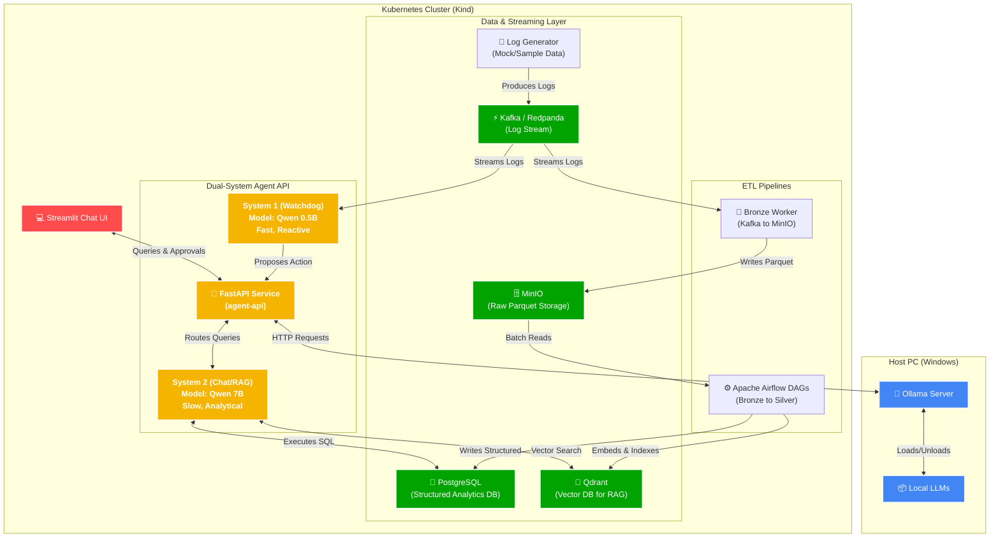

# Dual-System Agents

A Dual-System cognitive agent architecture for cluster observability: **System 1** provides fast anomaly detection over real-time log streams, while **System 2** handles deep log retrieval, analytical SQL querying, and guided cluster remediation.

## Architecture



*   **System 1 (Watchdog):** A small, fast, low-latency agent (`qwen2.5:0.5b`) continuously monitoring Kafka event streams (e.g., system logs). It identifies anomalies and proposes remediation actions, adding them to a Human-In-The-Loop (HITL) approval queue.
*   **System 2 (Chat/RAG):** A larger, more capable agent (`qwen2.5:7b`) handling the interactive Streamlit UI. It answers complex user queries using Retrieval-Augmented Generation (RAG) against system logs and executes remediation actions when instructed or when HITL approvals are granted.

## Features

*   **Kafka Event Streaming:** Simulates a real-time log stream.
*   **Vector Database (Qdrant):** Embeds and stores logs for RAG.
*   **Human-In-The-Loop (HITL):** Proposed actions by System 1 require user approval before execution.
*   **Kubernetes (Kind):** The entire backend runs in a local Kubernetes cluster.
*   **Local LLMs (Ollama):** Powered entirely by locally hosted models, ensuring privacy and zero API costs. 
    * *Note on Architecture:* In this local setup, Ollama runs on the Host PC rather than inside the Kubernetes cluster. This is an intentional design choice for local development, as passing Windows Host GPUs into local Docker/Kubernetes containers is notoriously complex. In a production environment, the inference engine would be deployed directly onto GPU-enabled Kubernetes nodes.

## Components

1.  `kafka-producer`: Generates mock system logs and anomalies.
2.  `qdrant`: Vector database for RAG.
3.  `agent-api`: FastAPI backend hosting the Dual-System agents.
    *   Watchdog task (System 1) consuming Kafka.
    *   REST endpoints (System 2) for chat and approvals.
4.  `chat-ui`: Streamlit frontend for interacting with the system.

## Setup Instructions

1.  **Prerequisites:** Docker, Kind, `kubectl`, Ollama.
2.  **Pull Models:**
    ```bash
    ollama pull qwen2.5:7b
    ollama pull qwen2.5:0.5b
    ollama pull nomic-embed-text
    ```
3.  **Start Cluster:**
    (Follow standard Kind cluster creation and deployment steps as defined in your workflow)

